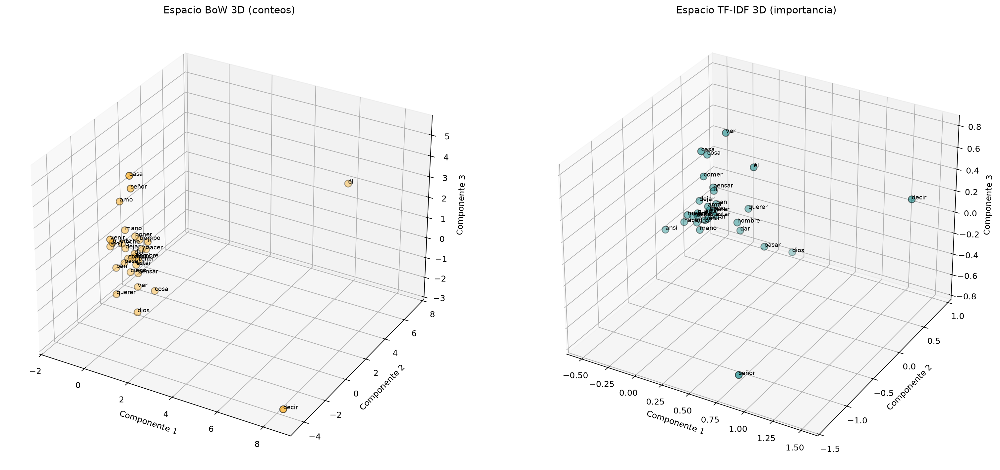
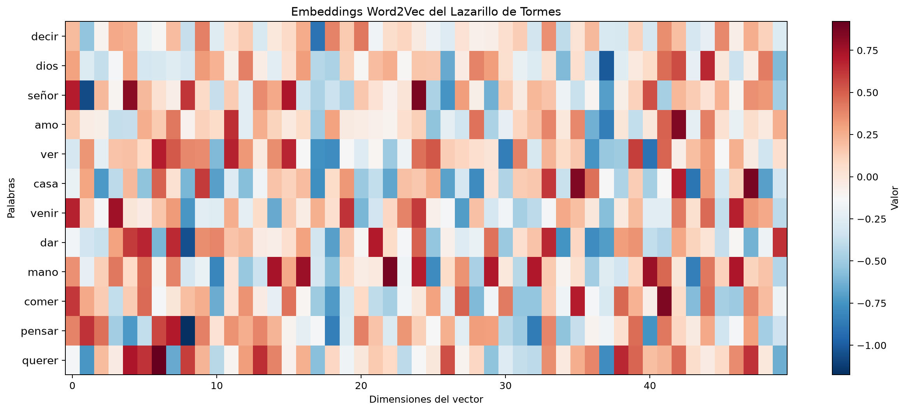
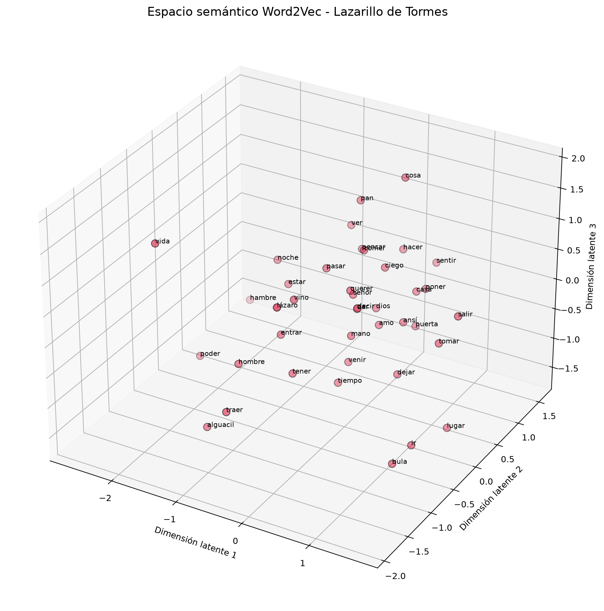

# Normalización, lematización y representación vectorial de texto

Actividad de los bloques 3, 4 y 5 de Procesamiento de Lenguaje Natural.

Este proyecto procesa el libro *Lazarillo de Tormes* mediante spaCy y su modelo en español. Posteriormente, transforma el texto utilizando representaciones clásicas y semántica distribucional.

## Procesos aplicados

* Carga del libro en formato TXT.
* Eliminación de los avisos de Project Gutenberg.
* Tokenización.
* Conversión de las palabras a minúsculas.
* Eliminación de stop words.
* Eliminación de signos de puntuación y espacios.
* Lematización.
* Generación del texto normalizado.
* Vectorización mediante Bag-of-Words.
* Vectorización mediante TF-IDF.
* Entrenamiento de Word2Vec con Skip-gram.
* Búsqueda de palabras semánticamente cercanas.
* Reducción de dimensiones mediante PCA.
* Generación de representaciones gráficas.

## Archivos principales

* `libro.txt`: libro original.
* `normalizar.py`: realiza la limpieza y lematización.
* `libro_normalizado.txt`: contiene el texto procesado.
* `vectorizar.py`: aplica Bag-of-Words, TF-IDF y PCA.
* `resultados_vectorizacion.txt`: contiene los resultados de la vectorización clásica.
* `grafica_vectorizacion_3d.png`: compara los espacios de BoW y TF-IDF.
* `semantica_distribucional.py`: entrena Word2Vec con el contenido del libro.
* `resultados_semantica.txt`: muestra palabras cercanas y sus valores de similitud.
* `heatmap_embeddings.png`: representa los valores de los embeddings.
* `espacio_semantico_3d.png`: muestra el espacio semántico de Word2Vec.
* `requirements.txt`: contiene las dependencias necesarias.

## Instalación

Instalar las dependencias:

```bash
python -m pip install -r requirements.txt
```

Instalar el modelo de spaCy en español:

```bash
python -m spacy download es_core_news_sm
```

## Ejecución

Para realizar la normalización y lematización:

```bash
python normalizar.py
```

Para aplicar Bag-of-Words y TF-IDF:

```bash
python vectorizar.py
```

Para entrenar Word2Vec y generar los espacios semánticos:

```bash
python semantica_distribucional.py
```

## Representación clásica

Bag-of-Words representa el texto mediante la cantidad de veces que aparece cada palabra.

TF-IDF asigna mayor importancia a las palabras que destacan dentro de una oración o documento.

PCA reduce las dimensiones de las matrices para permitir su representación mediante una gráfica 3D.



## Semántica distribucional

Word2Vec aprende relaciones entre palabras según los contextos en los que aparecen dentro del libro.

El modelo utiliza Skip-gram y genera un vector de 50 dimensiones para cada palabra. Las palabras utilizadas en contextos parecidos pueden aparecer más cerca dentro del espacio semántico.

### Heatmap de embeddings



### Espacio semántico en 3D


